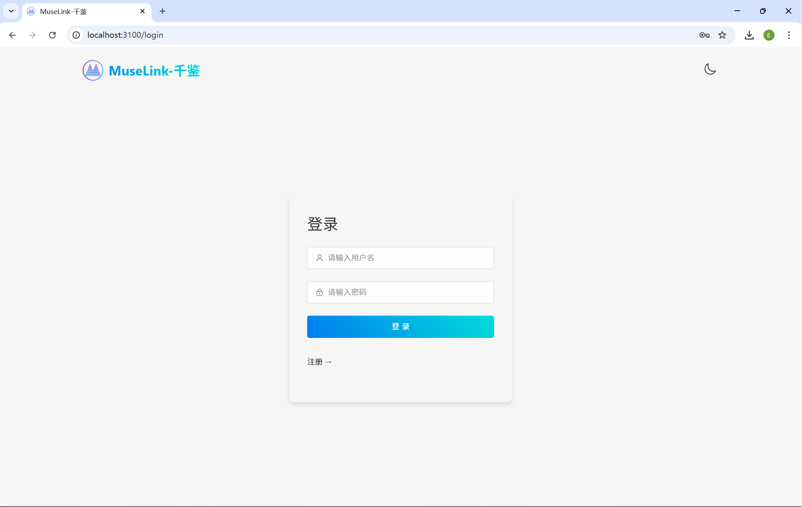
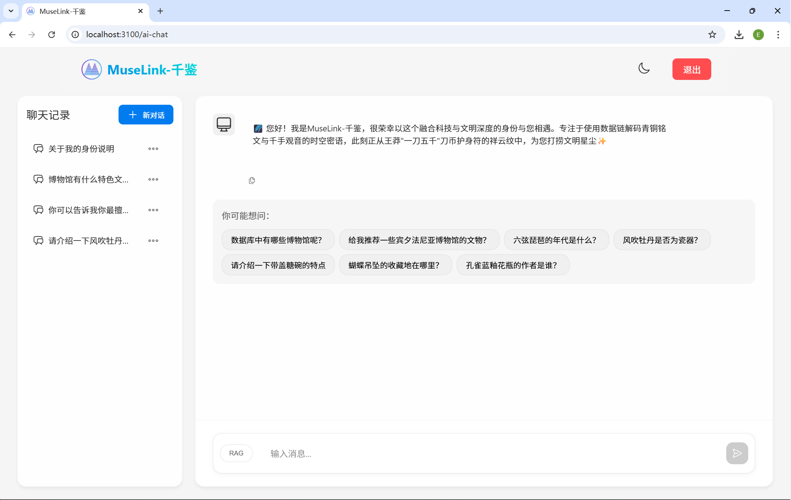
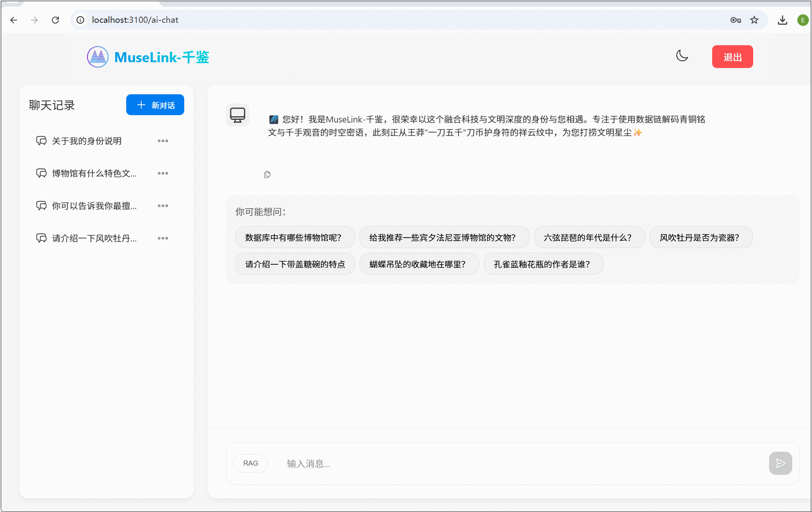

# 🏺 MuseLink-千鉴 | 海外藏中国文物知识问答子系统

MuseLink-千鉴 是一个基于大语言模型的智能知识问答系统，服务于海外藏中国文物的知识管理与信息服务平台 📚。
本系统结合 检索增强生成 (RAG) 技术、知识图谱与向量数据库，为用户提供准确、丰富、智能的文物知识问答体验 ✨。

## 🔧 核心功能

- 🤔 **简单问答**：支持文物的基础属性查询，如年代、材质、作者、收藏地等
- 🧠 **复杂问答**：支持多轮对话，追踪上下文，回答跨实体的复杂问题
- 💬 **文物闲聊**：可进行轻松友好的知识互动，兼顾趣味与科普
- 🕓 **历史记录**：自动保存问答历史，支持中断恢复，增强用户体验

## 🏗️ 技术架构

| 模块 | 技术选型 |
| ---- | -------- |
| 🎨 前端 | Vue3 + Vite，打造用户友好界面 |
| ⚙️ 后端 | Python Flask，提供 RESTful API |
| 🗃️ 数据库 | MySQL（用户数据）+ Neo4j（知识图谱）+ Milvus（语义向量检索） |
| 🤖 AI模型 | 接入大语言模型 API（如 Deepseek-r1）实现自然语言理解与生成 |

## 🚀 快速开始

请参考以下文档进行安装与部署：

- 📘 [后端README](./backend/README.md)
- 🖥️ [前端README](./frontend/README.md)

## 🔹 页面展示

### 🏠 系统首页
登录界面

### 💬 智能对话界面
支持上下文记忆与知识图谱检索

## 👨‍💻 开发团队

| 姓名 | 职责 |
| ---- | ---- |
| 🧭 [许楷烨](https://github.com/defyodd) | 项目组长，整体架构设计与 RAG 实现，PPT制作 |
| 🧰 熊家怡 | 后端框架搭建，问答核心逻辑开发 |
| 💻  [李卓](https://github.com/EzraLi) | 前端实现，撰写需求与接口文档 |
| 📄 苗少凯 | 协助文档整理与信息归纳 |
| 🧪 杨忆非 | 测试与演示材料准备 |
